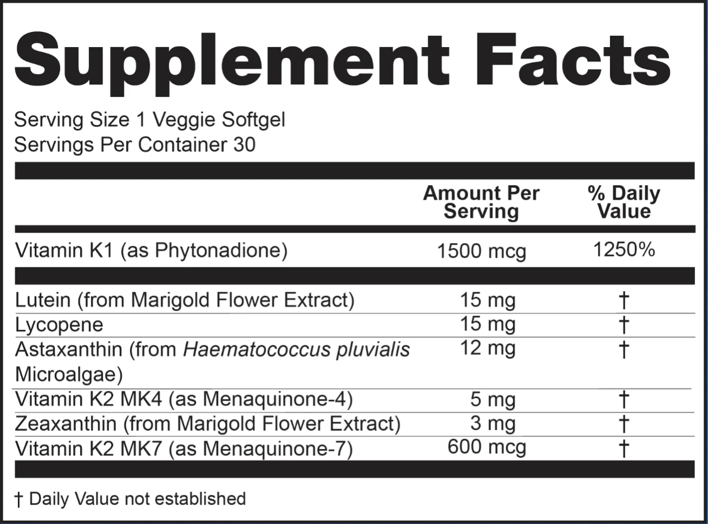
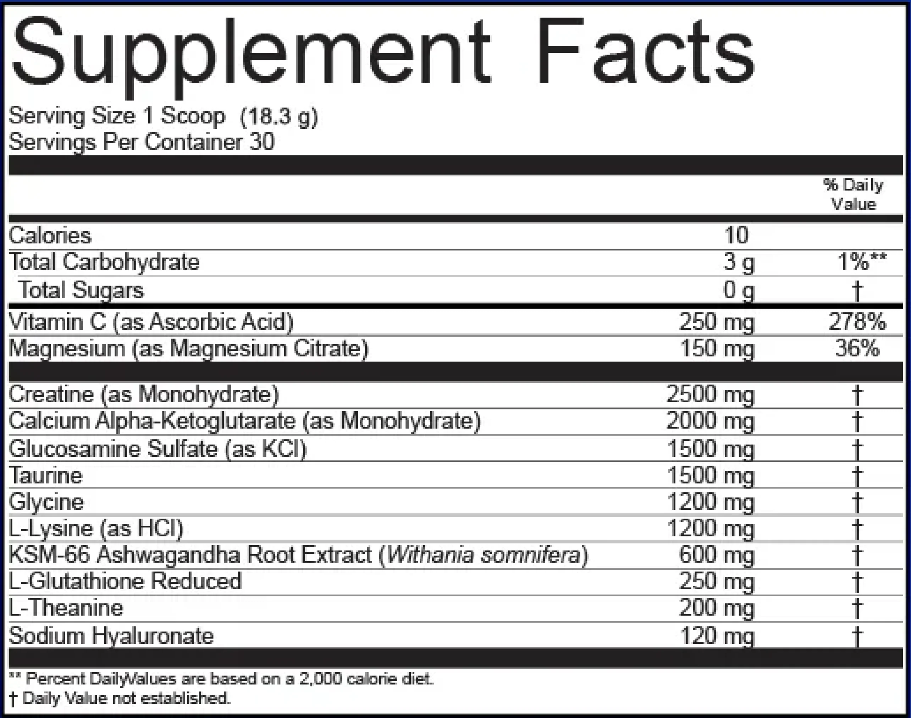

# Current supplements

## Blueprint equivalents

### Essentials capsules

- K2 + D3 and Calcium Magnesium D3
  - [/] Vitamin D (as Cholecalciferol, D3) - 50 mcg (2000 IU) => 25mcg - 2x daily
- [/] Vitamin E (d-alpha-Tocopherol) - 67 mg => 400 IU (268mg) - 1x every 3-4 days
- [/] B100 (either Jamieson or Kirkland) - 1x every 3-4 days
  - [x] Thiamin (Vitamin B1) (as HCI) - 1.1 mg => 100mg
  - [x] Riboflavin (Vitamin B2) - 1.4 mg => 100mg
  - [x] Niacin (as Niacinamide, B3) - 15 mg => 100mg
  - [x] Vitamin B6 (as Pyridoxine HCI) - 1.4 mg => 10mg
  - [x] Folate (as Calcium L-5 Methyltetrahydrofolate, B9) - 200 mcg DFE => 1000mcg
  - [x] Vitamin B12 (as Methylcobalamin) - 125 mcg => 500mg
  - [x] Biotin - 50 mcg => 200mg (Jamieson) / 100mg (Kirkland)
  - [x] Pantothenic Acid (as D-Calcium Pantothenate, B5) - 6 mg => 10mg
  - B6 (Pyridoxal 5-Phosphate) 10mg (Jamieson) / 100mg (Kirkland), Choline 10mg (Jamieson) / 100mg (Kirkland), Inositol 10mg (Jamieson) / 100mg (Kirkland)
- [/] Calcium Magnesium D3 - 1x every 3-4 days
  - [x] Calcium (from Carbonate and Dicalcium Phosphate => Citrate) - 50 mg
  - Magnesium 125mg, D3 5mcg
- [x] Iodine (as Potassium lodide) - 200 mcg => 1 teaspoon of table salt (NOT Himalayan pink salt)
- [/] Zinc (as Bisglycinate => Gluconate) - 15 mg => 50mg - 1x every 3-4 days
- [/] Selenium (as L-Selenomethionine) - 28 mcg => 200mg - 1x every 3-4 days
- [/] Manganese (as Citrate) - 1 mg => 5mg - 1x every 3-4 days

- [ ] Genistein (from S.japonica Extract) - 300 mg
- [ ] Nicotinamide Riboside (as Chloride) - 300 mg
- [ ] Rhodiola rosea Root Extract (std. 3% Rosavins / 1% Salidroside) - 300 mg
- [ ] Broccoli Seed Extract (Glucoraphanin 20 mg) - 200 mg
- [/] Fisetin (from Stem of Smoketree Extract) - 100 mg => 500mg - 1x every 3-4 days
- [ ] Luteolin (from Bud of S.japonica Extract) - 100 mg
- [ ] Ubiquinol (as Reduced CoQ10) - 50 mg
- [ ] Lactobacillus acidophilus (4 Billion CFU) - 20 mg
- [ ] Spermidine (as Trihydrochloride) - 10 mg
- [ ] Boron (as Glycinate) - 3 mg
- [ ] Lithium (as Orotate) - 1 mg

### NAC Ginger Curcumine

- [/] NAC (N-Acetyl-L-Cysteine) - 1200mg => 500 mg - 2x daily
- [ ] Ginger Root Extract (26% Gingeroids) - 400 mg
- [/] Curcumin (Turmeric, 85% Curcuma longa) - 250 mg => (95%) 500mg - 1x every 3-4 days

### Essential softgel

- [ ] Vitamin K1 (as Phytonadione) - 1500 mcg
- [ ] Lutein (from Marigold Flower Extract) - 15 mg
- [ ] Lycopene - 15 mg
- [ ] Astaxanthin (from Haematococcus pluvialis Microalgae) - 12 mg
- [ ] Zeaxanthin (from Marigold Flower Extract) - 3 mg
- [ ] Vitamin K2 MK4 (as Menaquinone-4) - 5 mg
- [/] K2 + D3
  - [x] Vitamin K2 MK7 (as Menaquinone-7) - 600 mcg => 2x daily

### Red Yeast Rice + Odor-free Garlic

- [/] Red Yeast Rice Extract - 500 mg - 2x daily (because of currently high Cholesterol)
- [x] Odorless Garlic 12:1 Extract - 100 mg => I love eating garlic (and don't mind the odor)

## Longevity Mix

### Longevity Mix

- [/] Vitamin C (as Ascorbic Acid) - 250 mg => 1000mg - 1x every 3-4 days
- [/] Magnesium (as Magnesium Citrate) - 150 mg - 1x every day
- [/] Creatine (as Monohydrate) - 2500mg => teaspoon of powdered Creatine daily
- [ ] Calcium Alpha-Ketoglutarate (as Monohydrate, CaAKG) - 2000 mg
- [ ] Glucosamine Sulfate (as KCl) - 1500 mg
- [/] Taurine - 1500 mg => 500md - 2x daily
- [ ] Glycine - 1200 mg
- [ ] L-Lysine (as HCl) - 1200 mg
- [ ] KSM-66 Ashwagandha Root Extract (Withania Somnifera) - 600 mg =>
- [ ] L-Glutathione Reduced - 250 mg =>
- [ ] L-Theanine - 200 mg => 250mg - 1x daily
- [ ] Sodium Hyaluronate - 120 mg
